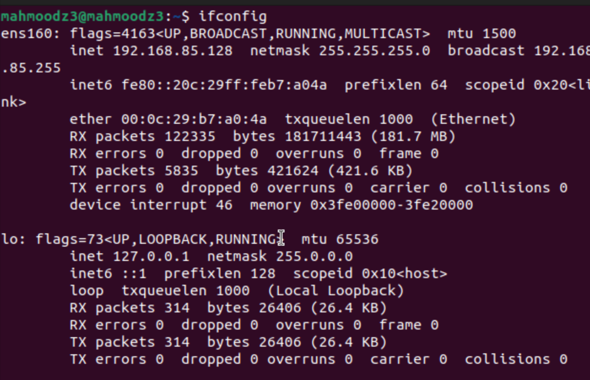
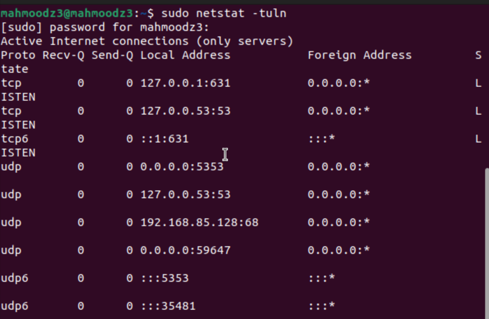
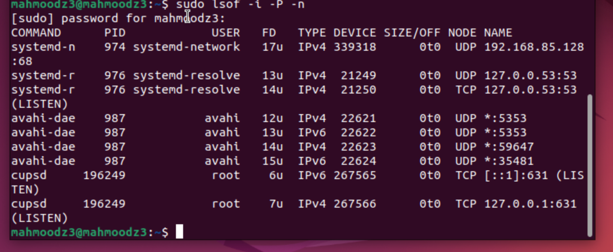
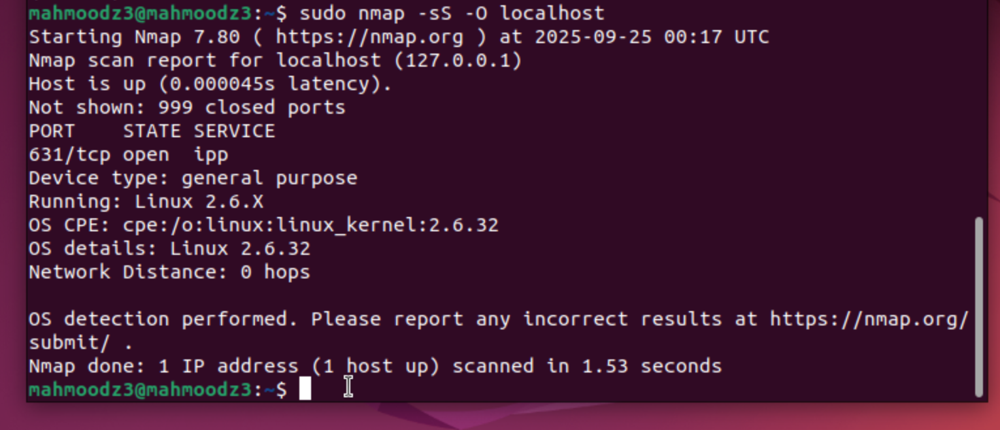
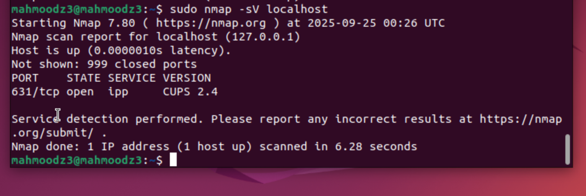
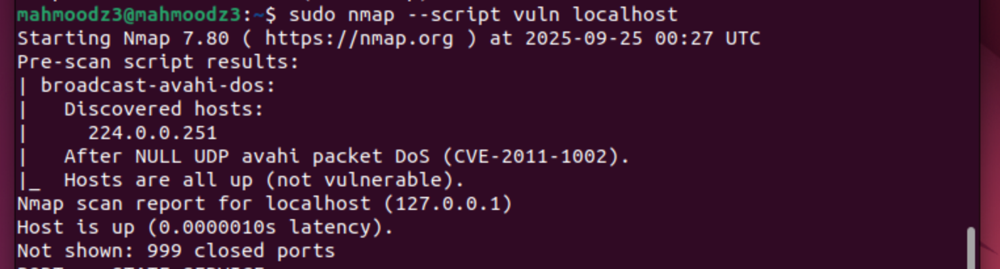
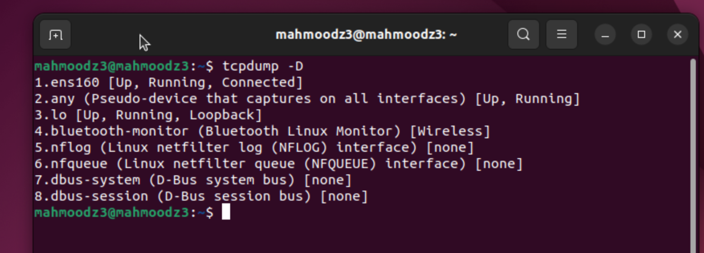
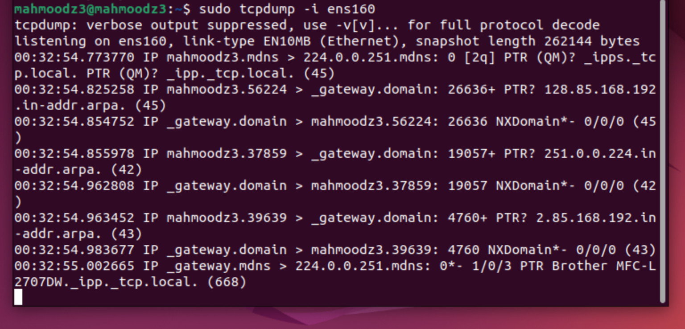
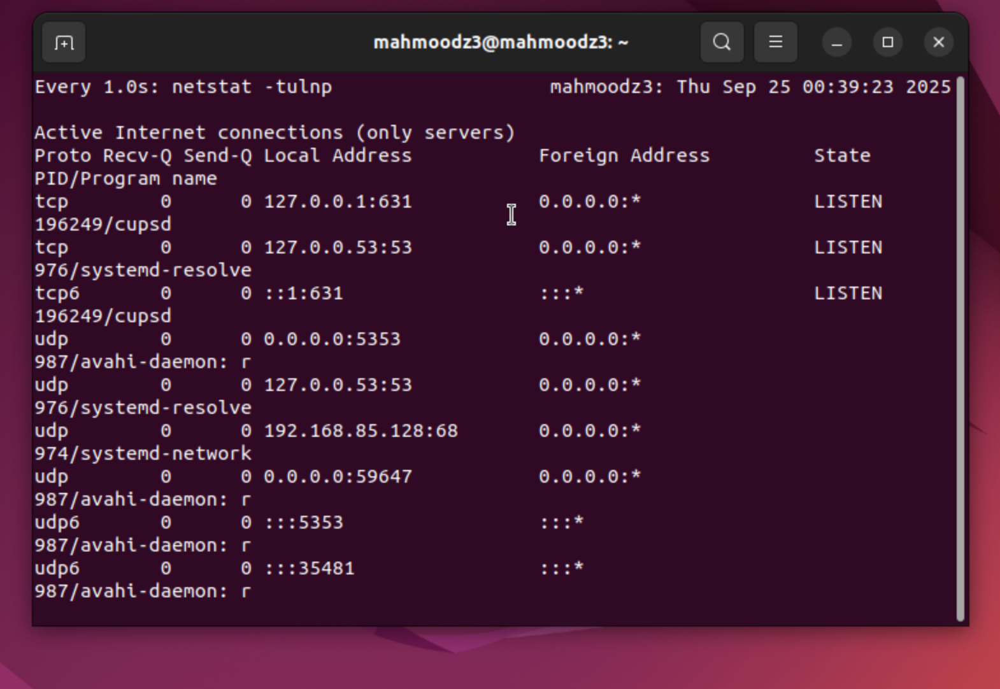
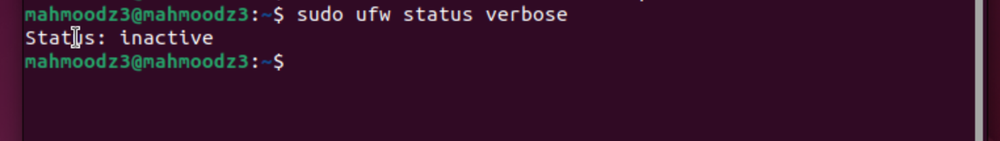

# Exploring Ubuntu Lab

## ifconfig 

Using the -ifconfig command on linux gives you access to basic IP data such as your home IPv4 netmask and any potential low level network errors related to your connection 

## sudo netstat -tuln or ss -tuln

The netstat -tuln command Lists all open ports on your network, these are some low level security configurations and diagnostic measures you can take. -t only shows TCP, -u only shows udp, -l is a listening state, and -n are names 

## sudo lsof -i -P -n

The lsof command again lists open network connections, lsof stands for list open files. The -i flag lists all network files. The -P and -n tags prevent resolution of Ip and port numbers. 

## sudo nmap -sS -O localhost

The nmap command scans your server to identify open ports, running services and the OS. Network Mapper is a tool that helps you discover hosts and servers on a network. The -sS flag performs a stealth TCP SYN scan, and -O flag attempts to determine the operating system of the target.

## sudo nmap -sP 192.168.1.0/24

The nmap -sP command performs a ping sweep to discover live hosts on the network. The /24 subnet notation scans all IP addresses in the 192.168.1.0-255 range.

## sudo nmap -sV localhost

The nmap -sV command performs service version detection on open ports. The -sV flag probes open ports to determine service/version info running on each port.

## sudo nmap --script vuln localhost

The nmap --script vuln command runs vulnerability detection scripts against the target. This flag executes NSE (Nmap Scripting Engine) scripts to identify known security vulnerabilities.

## sudo tcpdump -i eth0

The tcpdump command captures and displays network packets in real-time. The -i flag specifies which network interface to monitor (ens160 in this case).

## sudo watch -n 1 netstat -tulnp

The watch command repeatedly executes netstat every second to monitor network connections. The -n 1 flag sets the refresh interval to 1 second, and -p adds process IDs to the netstat output.

## sudo ufw status verbose

The ufw status verbose command displays detailed firewall status and rules. This shows whether UFW (Uncomplicated Firewall) is active and lists all configured firewall rules.Retry

