# Building a Lightweight SIEM and IDPS with Suricata, Loki, Promtail, and LogCLI
## Overview

A modern Security Information and Event Management (SIEM) system collects, aggregates, and analyzes security logs from across an organization's infrastructure to detect threats and provide actionable insights. An Intrusion Detection and Prevention System (IDPS) monitors network traffic for malicious activity and can take automated actions to block threats. 

**Suricata** is an open source network threat detection engine capable of intrusion detection (IDS), intrusion prevention (IPS), and network security monitoring that omits alerts and packets in JSON. **Loki** is Grafana's scalable, and lightweight log aggregation system. **Promtail** is an agent that ships local logs to a Loki.**LogCLI** is a command line tool for querying logs stored in Loki. All together we will be exploring and implementing each of these important network security tools on Ubuntu. We will also be using Docker a Container Platform to run and install Loki and Promtail without directly installing them in our Ubuntu Instance. 

## sudo apt update && sudo apt upgrade -y

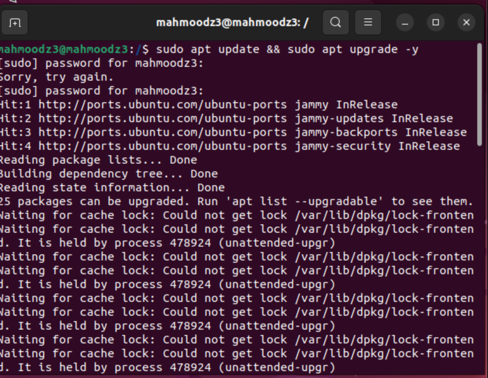

Ensure your system is up to date before installing any packages. Here we are updating our system before we start. 

## sudo apt -y install curl jq unzip

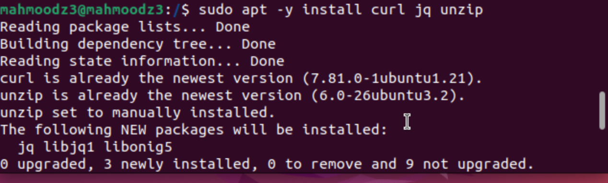

Install essential utilities needed for downloading and processing files. This command will install curl jq and unzip. 

## curl -fsSL https://get.docker.com | sudo sh

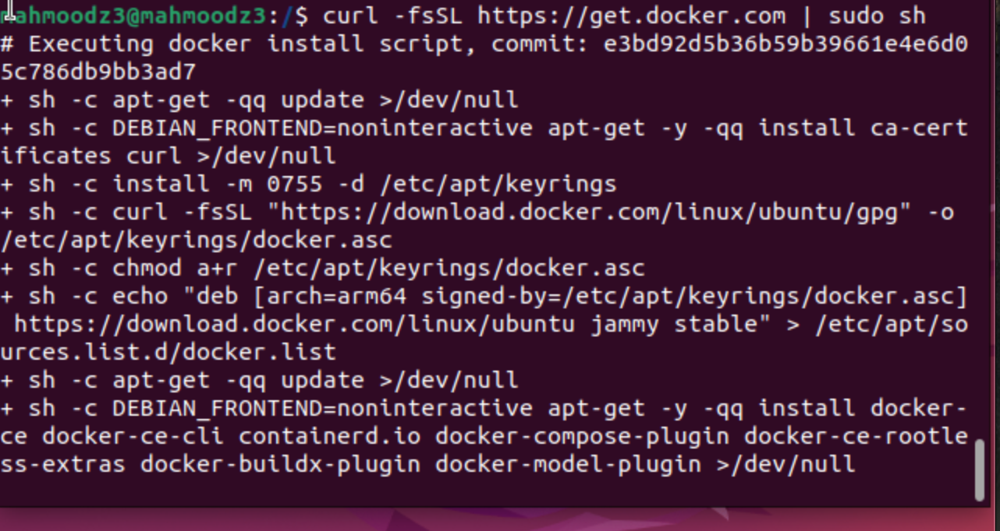

Download and install docker 

## sudo usermod -aG docker "$USER"
## newgrp docker

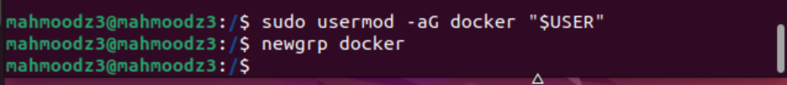

This commands adds you to the docker group to run Docker commands without sudo. The second command starts a fresh shell with the new group, docker.

## sudo systemctl enable --now docker
## docker --version

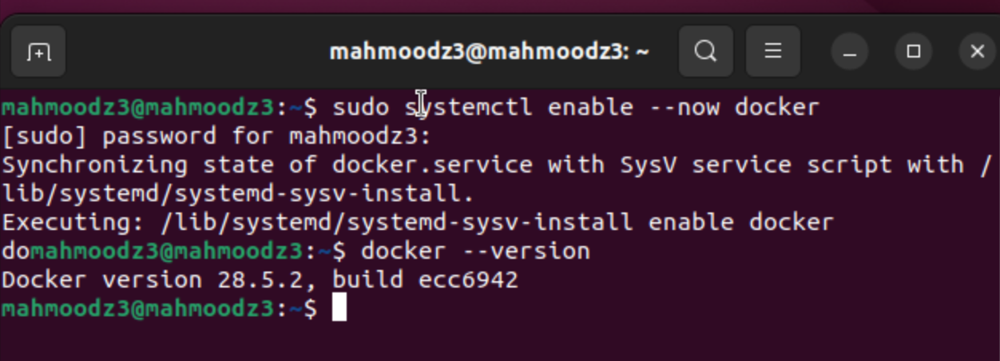

Enable Docker to start automatically on boot and verify the installation. The output here shows Docker version 28.5.2, build ecc6942.

## Suricata Vs. [SNORT](/SNORT/snort.md)

We've explored SNORT, and Suricata. They are both network intrusion detection systems (NIDS). SNORT has the advantage of being Lindy, and in the market for a longer time and in use in networking systems for a very long time in compared to Suricata. However Suricata offers a few key advantages, it is much quicker and able to offer a multi-threaded architecture in packet capture which can be significant advantage in a high traffic system. Both protocols are able to fully analyze packets, they can decode and analyze packets, Suricata has the added advantage of being able to interpret X-Forwarded-For (XFF) data. Which allows proxy servers to share information about the originating client. Snort generally consumes less resources then Suricata including memory, making it a good choice if you are resource constrained. Suricata generally has the added benefit of being a more user-friendly NIDS tool to start out with as compared to SNORT. SNORT offers more customization in terms of managin rules, and also has a larger online precence and history of community support. Ultimately choosing what tool comes down to your network needs, usecase and resources.

## sudo apt -y install suricata

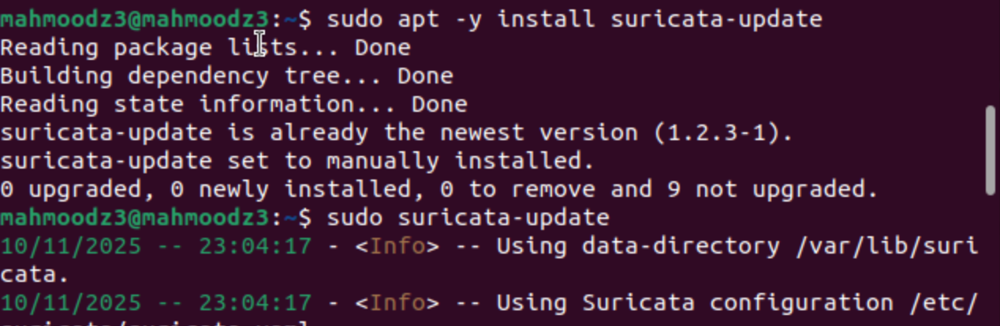

Install Suricata on your Ubuntu system. 

## sudo apt -y install suricata-update

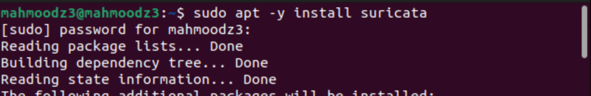

Install suricata-update tool to manage and update Suricata rules. The output shows suricata-update version 1.2.3-1 is already installed.

## sudo suricata-update

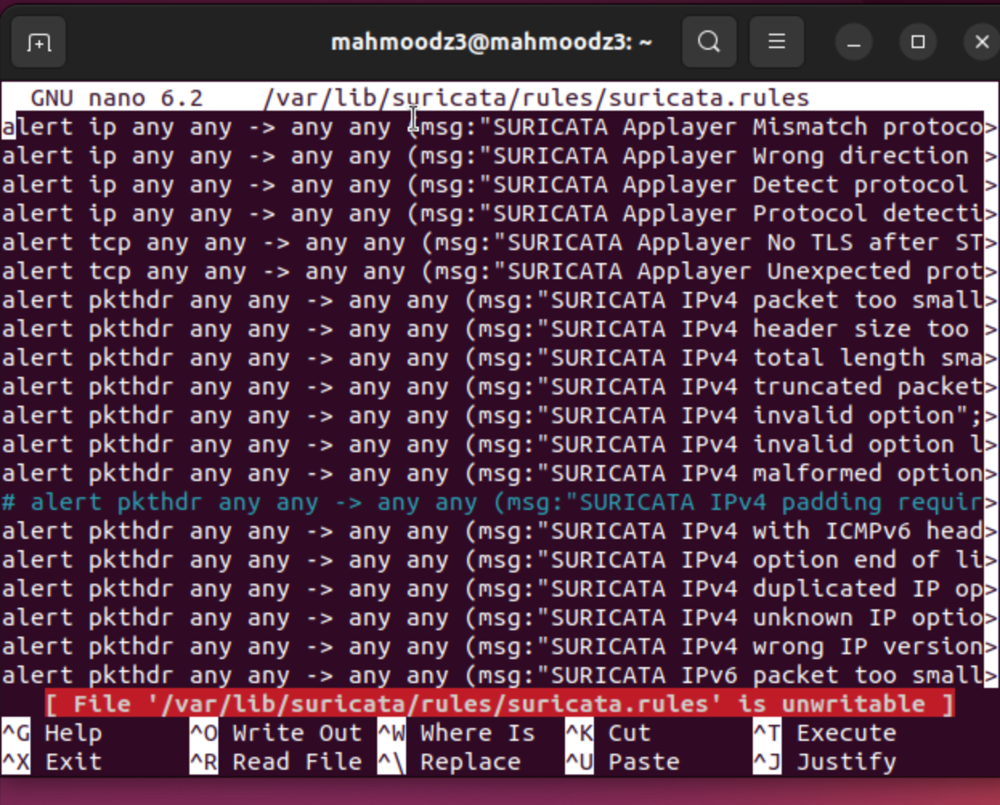

Run suricata-update to download and install the latest Suricata rulesets.

## nano /var/lib/suricata/rules/suricata.rules

View the default Suricata rules file to see the detection signatures. 

## ip -br a | awk '$1!="lo"{print $1, $3}'

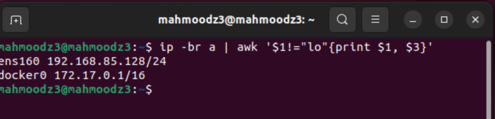

Identify your network interfaces and their IP addresses. The output shows ens160 with 192.168.85.128/24 and docker0 with 172.17.0.1/16.

## sudo mkdir -p /etc/suricata/rules
## sudo touch /etc/suricata/rules/local.rules

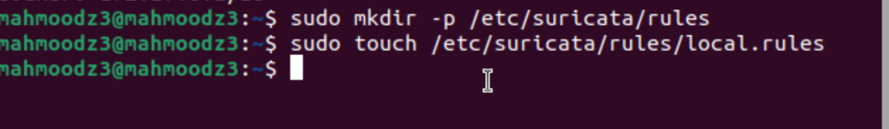

Create the rules directory and a local.rules file for custom Suricata rules. This allows you to add your own rules alongside the default rulesets.

## sudo nano /etc/suricata/suricata.yaml

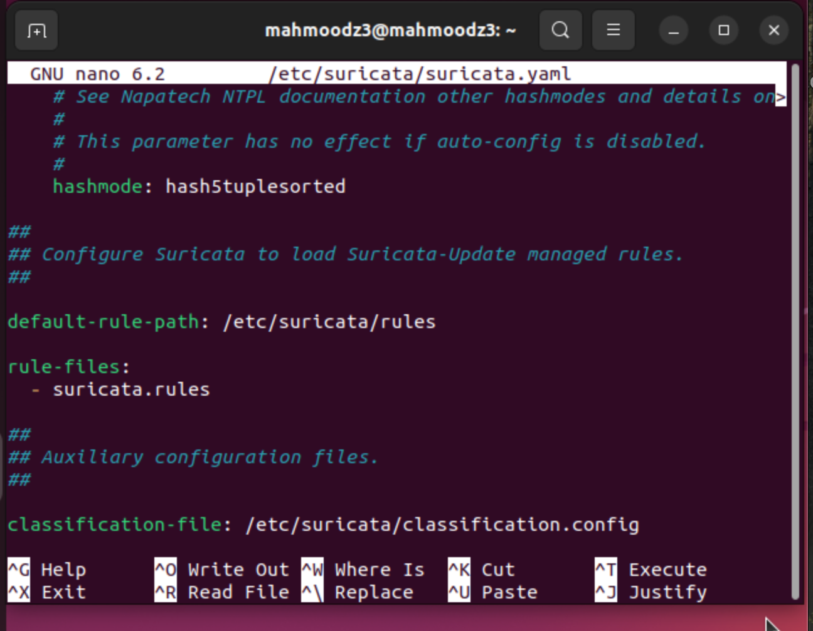

Open the main Suricata configuration file in nano. The file shows the default-rule-path set to /etc/suricata/rules and rule-files listing suricata.rules.

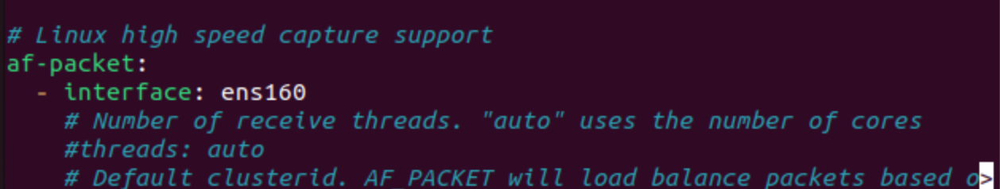

Configure the af-packet interface settings. The configuration shows interface, ens160 which we changed to match our interface identified earlier.

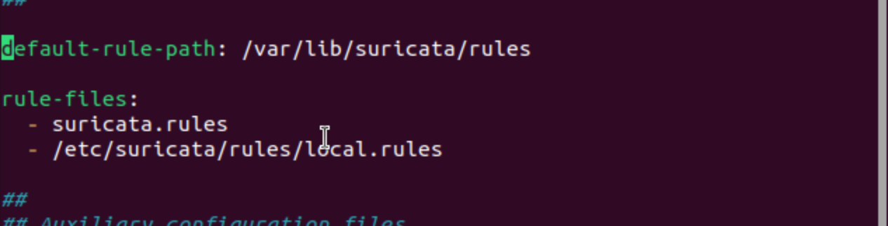

Update the default-rule-path to /var/lib/suricata/rules. Add /etc/suricata/rules/local.rules to the rule-files list for our custom rule support.

## sudo nano /etc/suricata/suricata.yaml
## sudo suricata -T -c /etc/suricata/suricata.yaml -v

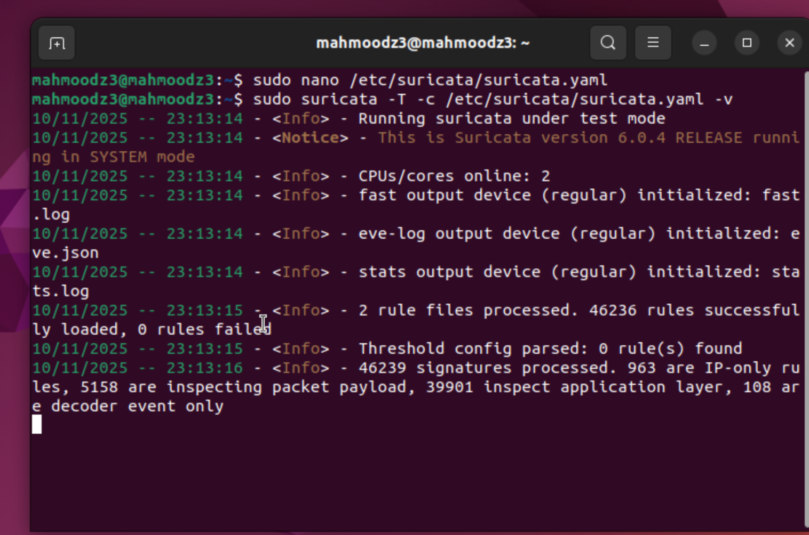

Test the Suricata configuration to ensure everything is set up correctly. The output shows Suricata version 6.0.4 running in test mode, with 2 rule files processed and 46236 rules successfully loaded.

The -T flag runs it in test mode, -c flag specifies the confconfiguration file to use and the -v flag provides a verbose output showing what Suricata is doing during the test. 

## sudo systemctl stop suricata
## sudo suricata -i $(ip -br a | awk '$1!="lo"{print $1; exit}') -D

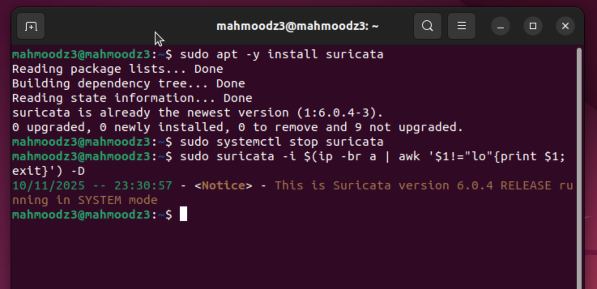

Stop any existing Suricata service and run Suricata in daemon mode on the network interface. The output shows Suricata version 6.0.4 RELEASE running in SYSTEM mode.

## sudo tail -f /var/log/suricata/eve.json | jq .

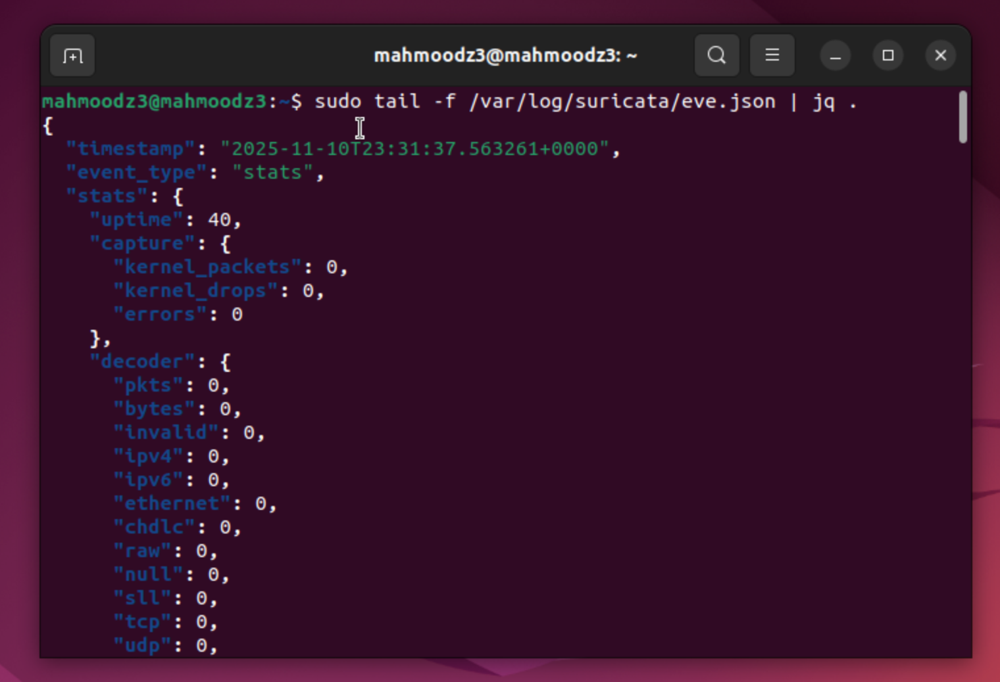

Monitor Suricata's EVE JSON log file in real-time with formatted output. The JSON shows event statistics including uptime, capture statistics (kernel_packets, kernel_drops, errors), and decoder statistics for various protocols.

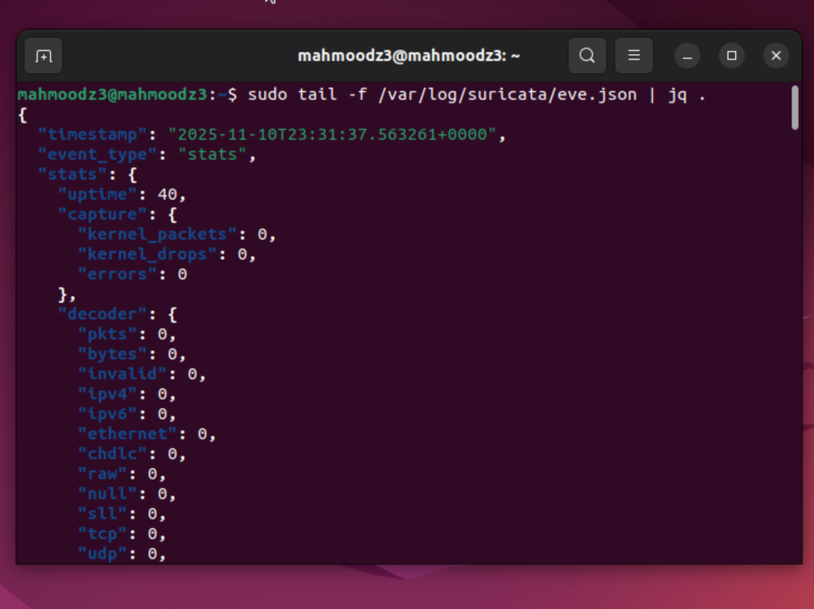

Continue monitoring the eve.json log file with jq formatting. The output displays detailed packet capture and decoder statistics in a readable JSON format.

Under "event_type" you will notice a stats event type. Which means Suricata is logging statistical information about its performance and packet processing activity.

