# Building a Lightweight SIEM and IDPS with Suricata, Loki, Promtail, and LogCLI
## Overview

A modern Security Information and Event Management (SIEM) system collects, aggregates, and analyzes security logs from across an organization's infrastructure to detect threats and provide actionable insights. An Intrusion Detection and Prevention System (IDPS) monitors network traffic for malicious activity and can take automated actions to block threats. 

**Suricata** is an open source network threat detection engine capable of intrusion detection (IDS), intrusion prevention (IPS), and network security monitoring that omits alerts and packets in JSON. **Loki** is Grafana's scalable, and lightweight log aggregation system. **Promtail** is an agent that ships local logs to a Loki.**LogCLI** is a command line tool for querying logs stored in Loki. All together we will be exploring and implementing each of these important network security tools on Ubuntu. We will also be using Docker a Container Platform to run and install Loki and Promtail without directly installing them in our Ubuntu Instance. 

## sudo apt update && sudo apt upgrade -y

Ensure your system is up to date before installing any packages. Here we are updating our system before we start. 

## sudo apt -y install curl jq unzip

Install essential utilities needed for downloading and processing files. This command will install curl jq and unzip. 

## curl -fsSL https://get.docker.com | sudo sh

Download and install docker 

## sudo usermod -aG docker "$USER"
## newgrp docker

This commands adds you to the docker group to run Docker commands without sudo. The second command starts a fresh shell with the new group, docker.

## sudo systemctl enable --now docker
## docker --version

Enable Docker to start automatically on boot and verify the installation. The output here shows Docker version 28.5.2, build ecc6942.

## Suricata Vs. [SNORT](/SNORT/snort.md)

We've explored SNORT, and Suricata. They are both network intrusion detection systems (NIDS). SNORT has the advantage of being Lindy, and in the market for a longer time and in use in networking systems for a very long time in compared to Suricata. However Suricata offers a few key advantages, it is much quicker and able to offer a multi-threaded architecture in packet capture which can be significant advantage in a high traffic system. Both protocols are able to fully analyze packets, they can decode and analyze packets, Suricata has the added advantage of being able to interpret X-Forwarded-For (XFF) data. Which allows proxy servers to share information about the originating client. Snort generally consumes less resources then Suricata including memory, making it a good choice if you are resource constrained. Suricata generally has the added benefit of being a more user-friendly NIDS tool to start out with as compared to SNORT. SNORT offers more customization in terms of managin rules, and also has a larger online precence and history of community support. Ultimately choosing what tool comes down to your network needs, usecase and resources.

## sudo apt -y install suricata

Install Suricata on your Ubuntu system. 

## sudo apt -y install suricata-update

Install suricata-update tool to manage and update Suricata rules. The output shows suricata-update version 1.2.3-1 is already installed.

## sudo suricata-update

Run suricata-update to download and install the latest Suricata rulesets.

## nano /var/lib/suricata/rules/suricata.rules

View the default Suricata rules file to see the detection signatures. 

## ip -br a | awk '$1!="lo"{print $1, $3}'

Identify your network interfaces and their IP addresses. The output shows ens160 with 192.168.85.128/24 and docker0 with 172.17.0.1/16.

## sudo mkdir -p /etc/suricata/rules
## sudo touch /etc/suricata/rules/local.rules

Create the rules directory and a local.rules file for custom Suricata rules. This allows you to add your own rules alongside the default rulesets.

## sudo nano /etc/suricata/suricata.yaml

Open the main Suricata configuration file in nano. The file shows the default-rule-path set to /etc/suricata/rules and rule-files listing suricata.rules.

Configure the af-packet interface settings. The configuration shows interface, ens160 which we changed to match our interface identified earlier.

Update the default-rule-path to /var/lib/suricata/rules. Add /etc/suricata/rules/local.rules to the rule-files list for our custom rule support.

## sudo nano /etc/suricata/suricata.yaml
## sudo suricata -T -c /etc/suricata/suricata.yaml -v

Test the Suricata configuration to ensure everything is set up correctly. The output shows Suricata version 6.0.4 running in test mode, with 2 rule files processed and 46236 rules successfully loaded.

The -T flag runs it in test mode, -c flag specifies the confconfiguration file to use and the -v flag provides a verbose output showing what Suricata is doing during the test. 

## sudo systemctl stop suricata
## sudo suricata -i $(ip -br a | awk '$1!="lo"{print $1; exit}') -D

Stop any existing Suricata service and run Suricata in daemon mode on the network interface. The output shows Suricata version 6.0.4 RELEASE running in SYSTEM mode.

## sudo tail -f /var/log/suricata/eve.json | jq .

Monitor Suricata's EVE JSON log file in real-time with formatted output. The JSON shows event statistics including uptime, capture statistics (kernel_packets, kernel_drops, errors), and decoder statistics for various protocols.

Continue monitoring the eve.json log file with jq formatting. The output displays detailed packet capture and decoder statistics in a readable JSON format.

Under "event_type" you will notice a stats event type. Which means Suricata is logging statistical information about its performance and packet processing activity.

## Loki is a tool created by Grafana labs, which is a userfriendly and performant way of effectively logging and managing logs in various enviroments, networks and systems. Loki can process multiple kinds of logs including Event logs, Server Logs, System Logs (syslog) Authorization and Access Logs, Change Logs and more. We will be exploring a few them here. 

## sudo mkdir -p /etc/loki /var/lib/loki/{chunks,rules}

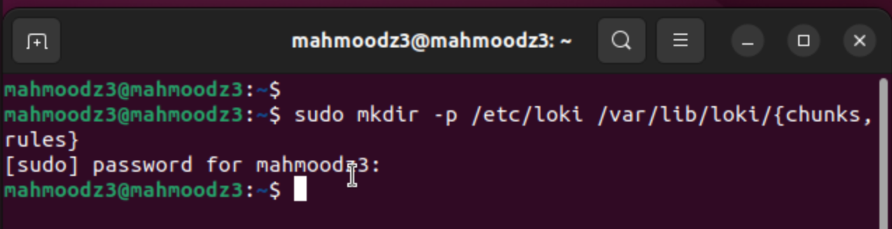

Create the necessary directories for Loki configuration and data storage. The -p flag creates a parent directories as needed, setting up /etc/loki for config files and /var/lib/loki subdirectories for chunks and rules.

## cat <<'EOF' | sudo tee /etc/loki/loki-config.yml

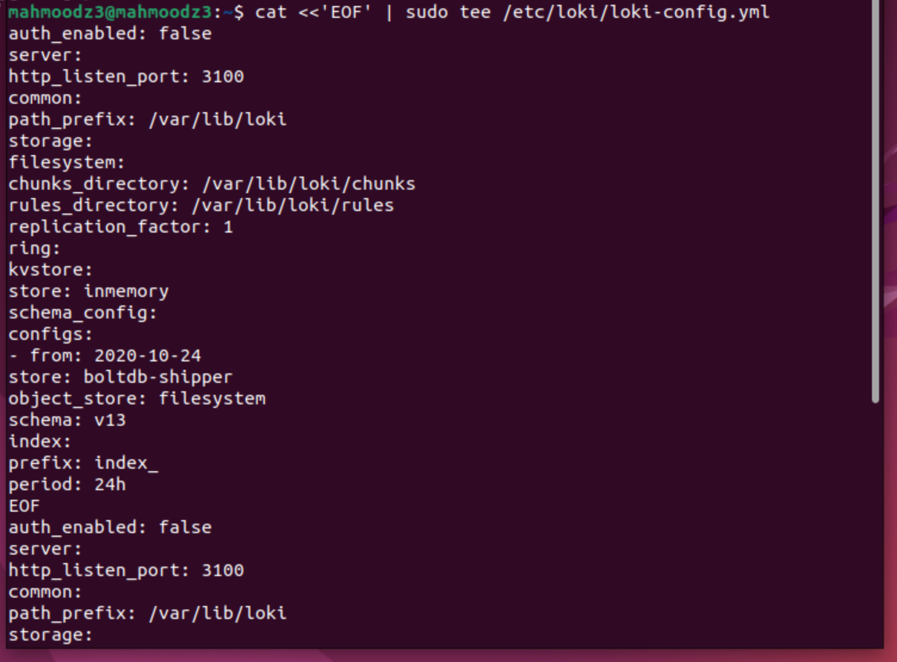

Create the Loki configuration file 

## sudo chown -R 10001:10001 /var/lib/loki

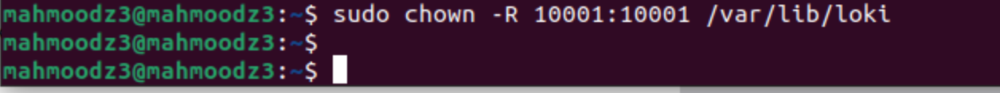

Change ownership of the Loki data directory to user and group 10001. This matches the user ID that Loki runs as inside the Docker container.

## sudo chmod -R u+rwX /var/lib/loki

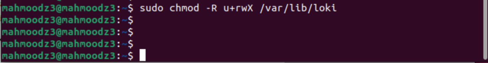

Set appropriate permissions on the Loki directory. The u+rwX flag gives the owner read, write, and execute permissions.

## sudo docker run -d --name loki -p 3100:3100 -v /etc/loki:/etc/loki -v /var/lib/loki:/var/lib/loki grafana/loki:2.9.8 -config.file=/etc/loki/loki-config.yml

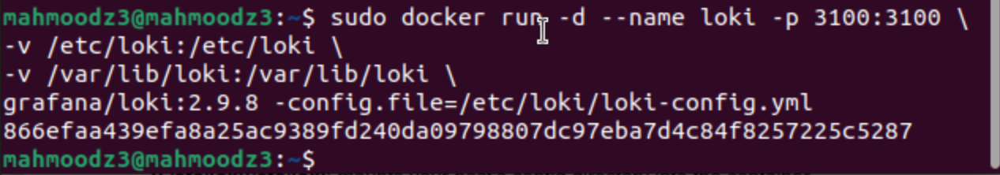

Run Loki as a Docker container, the command mounts the configuration and data directories, exposes port 3100, and uses the grafana/loki:2.9.8 image with our custom config file.

## sudo docker ps

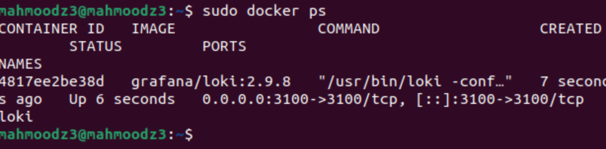

Verify the Loki container is running. The output shows the container with ID 4817ee2be38d is up and running, using the grafana/loki:2.9.8 image with port 3100 mapped.

Loki exposes port 3100, and the API path that receives log data is /loki/api/v1/push 
This is the endpoint where log shippers like Promtail send log entries to Loki for storage and indexing. Which we will be using next. 

## sudo mkdir -p /etc/promtail /var/lib/promtail

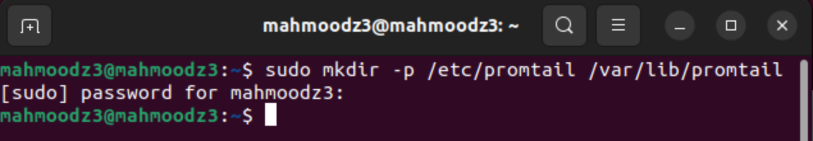

Make the necessary directories for Promtail. The -p flag creates the parent directory.

## cat <<'EOF' | sudo tee /etc/promtail/promtail-config.yml

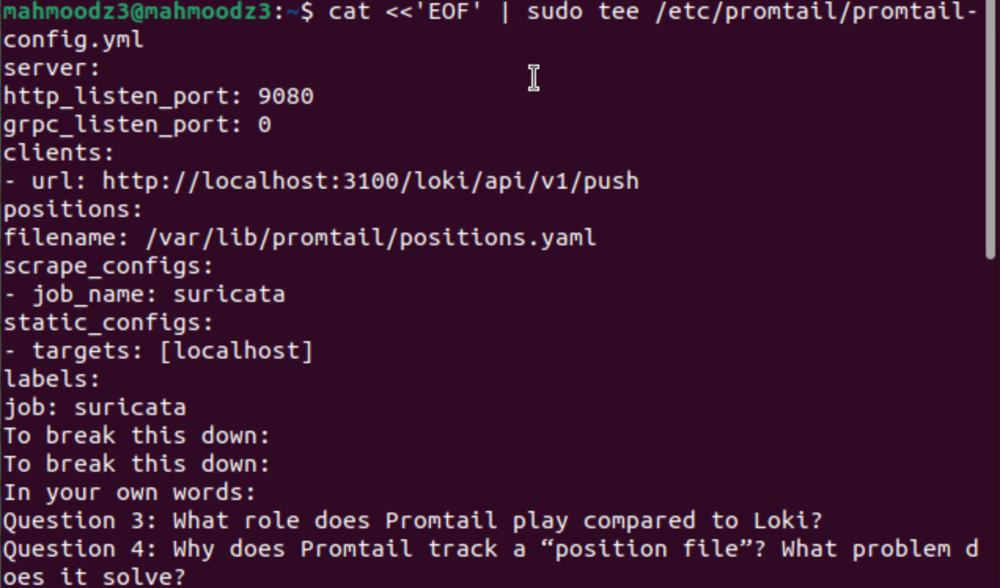

This promtail configuration sets up the server on port 9080, defines the Loki client URL (http://localhost:3100/loki/api/v1/push), positions file location, and scrapes configs for the suricata job.

## sudo docker run -d --name promtail -p 9080:9080 -v /etc/promtail:/etc/promtail -v /var/log/suricata:/var/log/suricata:ro -v /var/lib/promtail:/var/lib/promtail grafana/promtail:2.9.8 -config.file=/etc/promtail/promtail-config.yml

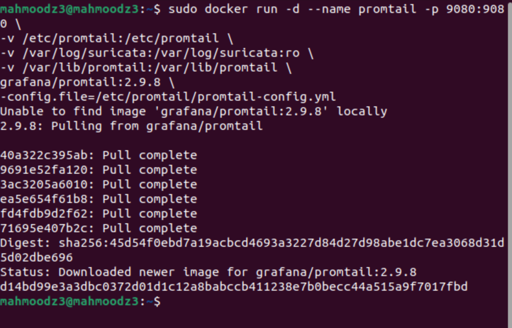

Run Promtail as a Docker container. We then name the container. We map it to port 9080 which is Promtail's HTTP status page. We then mount the config, and share which config the container is inside. We also make it so Promtail can read eve.json, from suricata which we created earlier. 

**What role does Promtail play compared to Loki?**

Promtail acts as the log shipping agent that collects and forwards logs to Loki. While Loki is the centralized log aggregation system that stores and indexees logs. Promtail runs reads the log files, and pushes them to Loki's API. 

**Why does Promtail track a "position file?**

Promtail tracks a position file to remember where it left off reading log files. This solves the problem of duplicate log entries or missing logs when Promtail restarts. 

## curl -L https://github.com/grafana/loki/releases/download/v2.9.8/logcli-linux-arm64.zip -o /tmp/logcli.zip

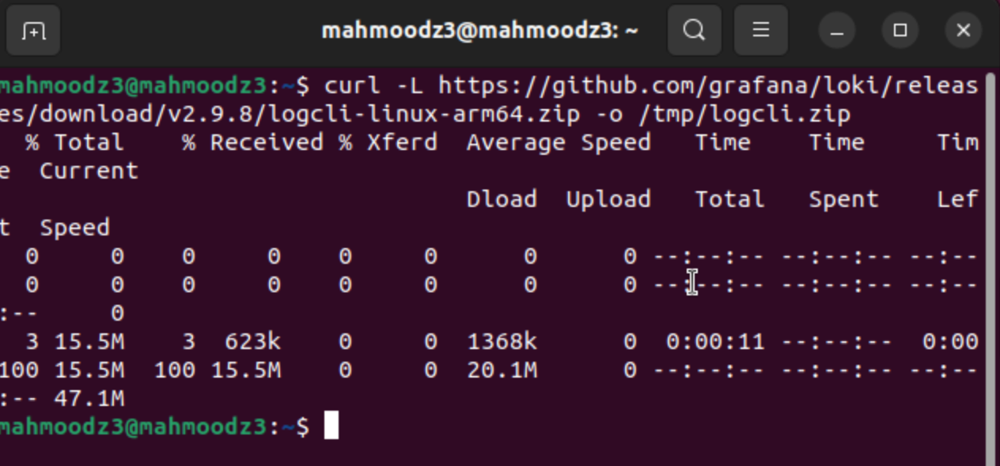

Download LogCLI from the Grafana GitHub. 

## sudo unzip -o /tmp/logcli.zip -d /usr/local/bin
## sudo mv /usr/local/bin/logcli-linux-arm64 /usr/local/bin/logcli
## sudo chmod +x /usr/local/bin/logcli
## logcli --version

Extract LogCLI from the zip file, rename it for easier use, make it executable, and verify. Here the output shows logcli version 2.9.8. 

## logcli labels --addr=http://localhost:3100

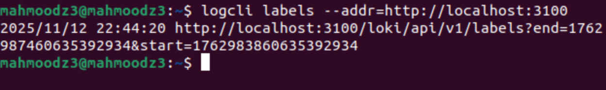

Query Loki to list all available labels in the stored logs. The command connects to the Loki API at localhost:3100.

## logcli query --addr=http://localhost:3100 --limit=10 '{job="suricata"}'

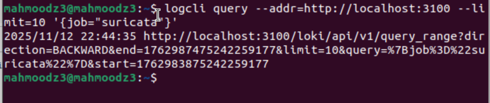

Query Loki for the last 10 log entries with the job label set to "suricata". The command connects to Loki's query API and retrieves logs matching our selector, which is suricata.

The primary label attached to our logs is `job="suricata"` 

**How do labels differ from full-text indexes?**

Labels are indexed metadata tags that allow for fast, efficient filtering of log streams before searching content. They work like database indexes. Loki uses labels to quickly identify which log streams to search, making queries much faster. Full text indexes, on the other hand, index the entire content of logs, which is storage intensive and slower. 

## echo 'alert http any any -> any any (msg:"LAB UA hit"; http.user_agent; content:"CPS-NETSEC-LAB"; sid:9900001; rev:1;)' | sudo tee -a /etc/suricata/rules/local.rules

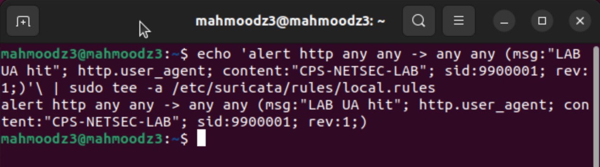

Create a custom Suricata rule to detect HTTP traffic with a specific User-Agent string. The rule appends to local.rules and will trigger an alert when it detects "CPS-NETSEC-LAB" in the User-Agent header.

## sudo systemctl restart suricata

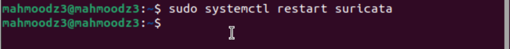

Restart the Suricata service to load the new custom rule. This ensures Suricata picks up the changes made to local.rules.

## sudo suricata -T -c /etc/suricata/suricata.yaml -v

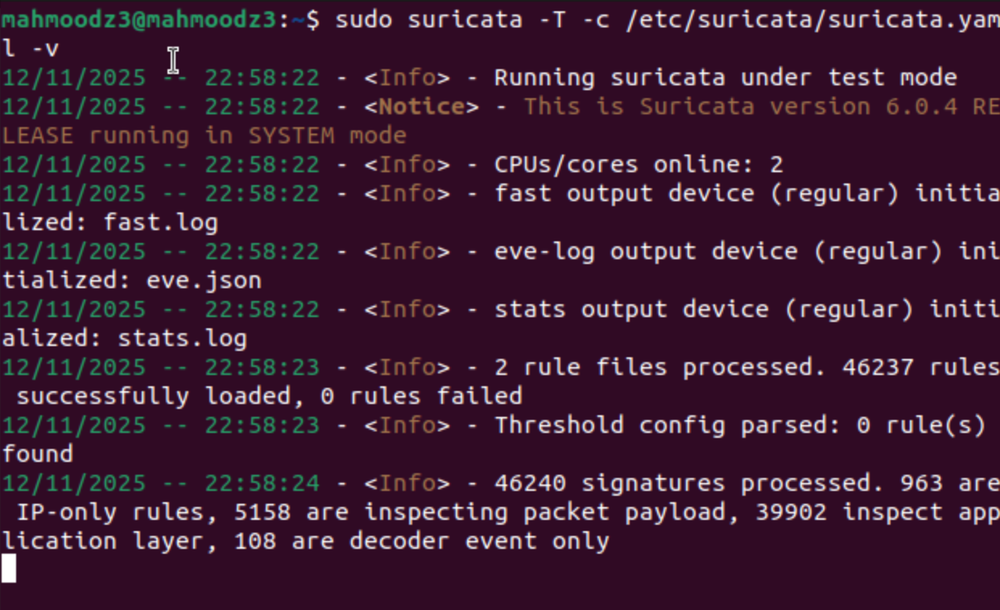

Test the Suricata configuration to verify the new rule loaded successfully. The output shows Suricata version 6.0.4 running in test mode with 2 rule files processed and 46237 rules successfully loaded (one more than before).

## curl -A "CPS-NETSEC-LAB" http://example.com/ | true

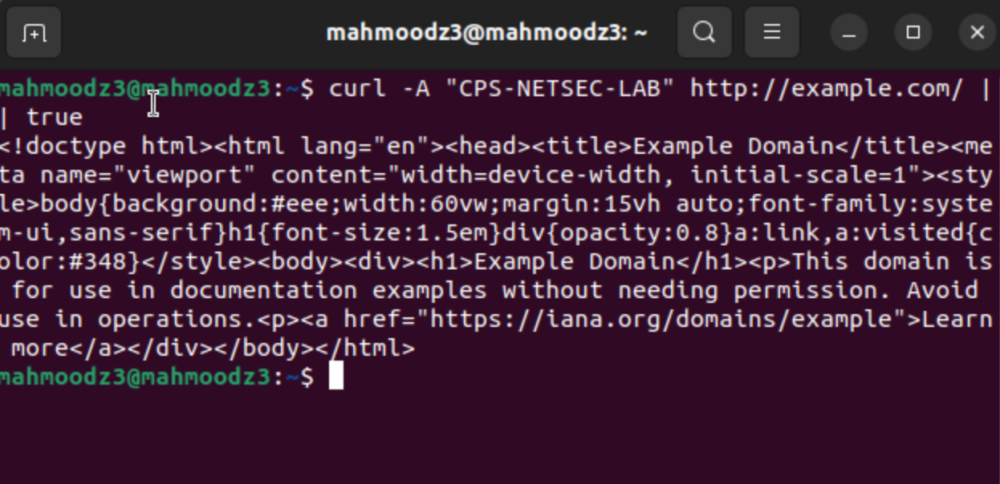

Generate test traffic to trigger the custom Suricata rule. The curl command sends an HTTP request to example.com with the User-Agent set to "CPS-NETSEC-LAB", which should match our detection rule.

## logcli query --addr=http://localhost:3100 --limit=50 '{job="suricata"} |= "event_type\":\"alert\"' | jq | line_format "{{.alert.signature}}"

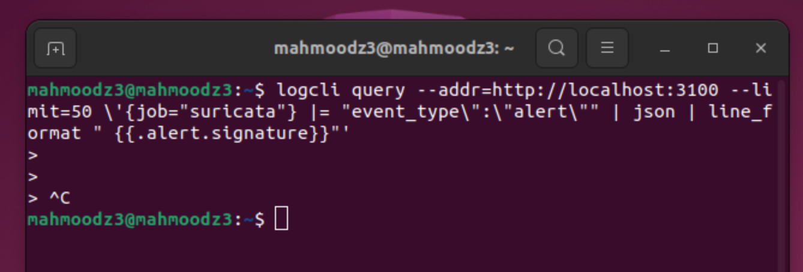

Query Loki for alert events from Suricata logs and format the output to show alert signatures. The command searches for logs with event_type "alert". Currently we have no alert triggers pop up as the system is freshly setup. Use ctrl + c to exit.

## logcli query --addr=http://localhost:3100 --limit=1000 --since=5m '{job="suricata"} |= "event_type\":\"alert"' | jq -r '.line' | jq '.src_ip' | sort | uniq -c | sort -nr | head

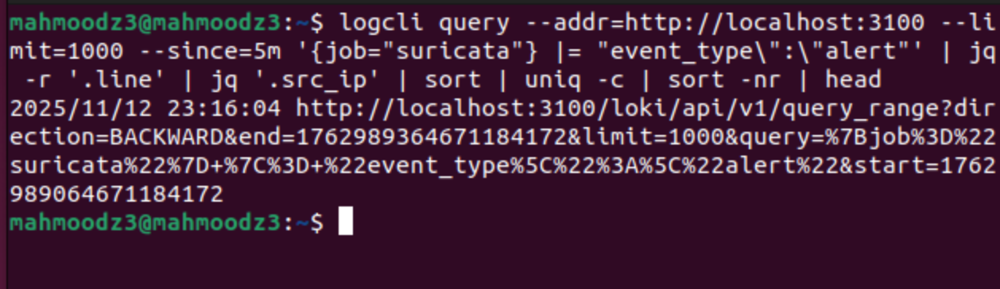

Query Loki for alerts from the last 5 minutes and analyze source IP addresses.

**What does this simple command illustrate about correlation and aggregation in SIEMs?**

This command demonstrates SIEM correlation and aggregation by taking raw alert data and transforming it into actionable intelligence. It takes multiple alert events by a common IP, aggregates them, and ranks them by frequency.

**How might a SOC use this information in an investigation?**

A SOC analyst could use this aggregated view to prioritize investigations by focusing on the IP addresses generating the most alerts first, as they represent the highest volume of suspicious activity. They could then pivot to investigate what types of alerts that IP triggered, what destination systems it targeted, and prevent lateral movement throughout a compromised system if it gets to that point. 

## echo 'alert icmp any any -> any any (msg:"LAB ICMP Ping Detected"; itype:8; sid:9900004; rev:1;)' | sudo tee -a /etc/suricata/rules/local.rules

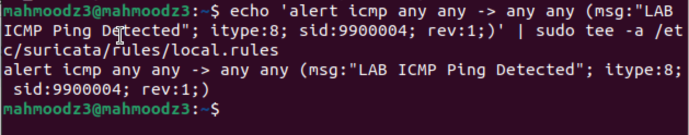

Create a custom Suricata rule to detect ping traffic. The rule triggers on any ICMP packet with an echo request type from any source to any destination.

## sudo systemctl restart suricata
## ping -c 10 9.9.9.9

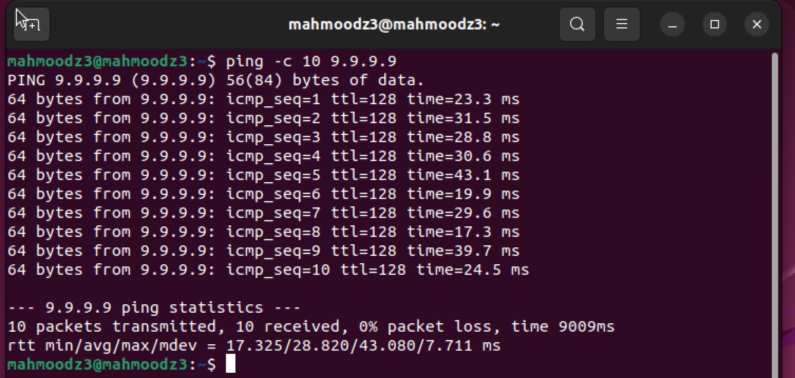

Restart Suricata to load the new rule, then generate ICMP traffic by pinging 9.9.9.9. The ping completes successfully with 10 packets transmitted and received.

## sudo tail -100 /var/log/suricata/eve.json | jq 'select(.event_type == "alert" or .event_type == "icmp")'

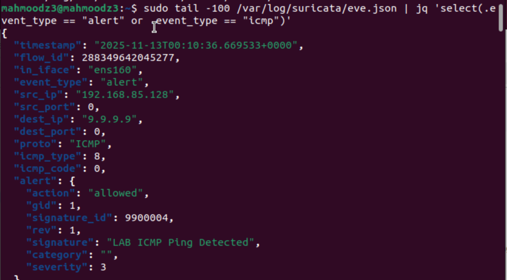

Verify the alert was triggered by checking the Suricata logs in eve.json. The output shows our custom rule successfully detected the ping traffic from source IP 192.168.85.128 to destination 9.9.9.9.

This rule detected ICMP echo request packets (ping requests) with type 8. These are standard ping packets sent when using the ping command to test network connectivity.

**How did you test and confirm that it triggered correctly?**

I tested the rule by using the ping command to send ICMP packets to 9.9.9.9, then verified the alert was generated by checking the eve.json log file. The log showed an event_type of "alert", confirming the rule triggered successfully.

**How would you modify your rule to make it more specific (to reduce false positives)? Why is fine-tuning rules important in real-world intrusion detection?**

To make the rule more specific, I could add conditions like limiting it to specific source destination networks, setting thresholds to only alert on excessive ping activity, or combining it with other indicators. 

## Wrapping Up

In this lab, we successfully implemented a lightweight yet powerful SIEM and IDPS solution by integrating Suricata, Loki, Promtail, and LogCLI on Ubuntu. We configured it all in containers using Docker. We used Suricata as our network intrusion detection engine to monitor traffic and generate alerts based on custom rules, while Loki provided log aggregation. Promtail acted as our log shipping agent, reading Suricata's eve.json output and forwarding it to Loki, and LogCLI gave us command line query capabilities to search, filter, and analyze security events. Through hands on configuration and testing, we explored the complete threat detection pipeline from rule creation and packet inspection to log aggregation and analysis learning how custom Suricata rules detect specific network patterns, how labels enable fast log filtering in Loki, and how aggregation transforms raw alerts into actionable intelligence for security analysts. This architecture demonstrates key SIEM principles of centralized logging, real-time detection, efficient storage, and flexible querying. 