## Intro to SNORT an Open Source Intrusion Prevention System 
## This exploration documents the installation, configuration, and deployment of Snort, an open source intrusion detection prevention system (IDPS). Snort functions as a network security tool that monitors network traffic in real time, analyzing packets against a rule set to detect suspicious activity, we will be configuring said rule set in our exploration today. The objective of this lab is to successfully deploy Snort on Ubuntu, configure it to monitor a specific network interface, implement some detection rules, and validate its working and running in both interactive and daemon modes. 

### sudo apt update

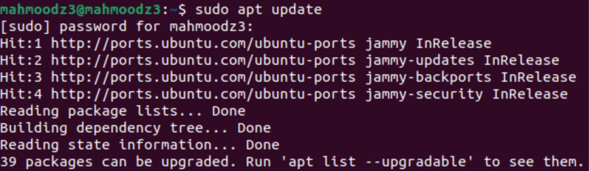

Ensure your system is up to date before installing Snort. This command updates the package lists for upgrades and new package installations.

## Step 2: Install Snort

### sudo apt install snort -y

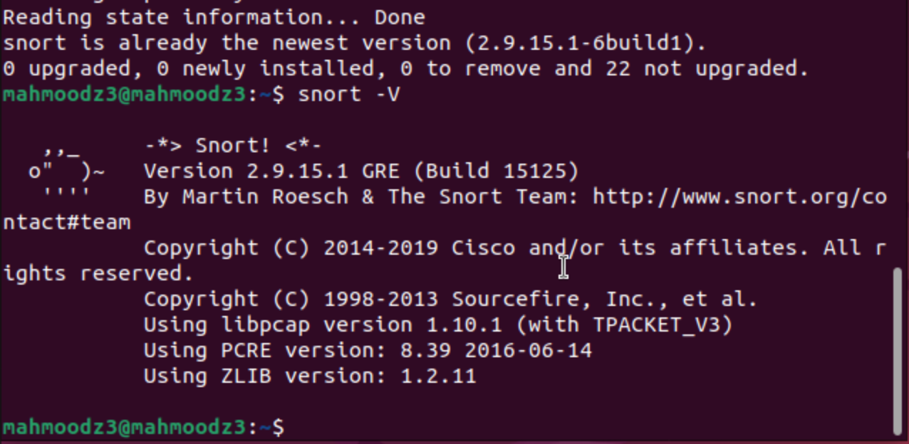

Snort can be installed directly using apt. As shown in the image, we now have Snort Version 2.9.15.1 GRE (Build 15125) successfully installed.

### ip a

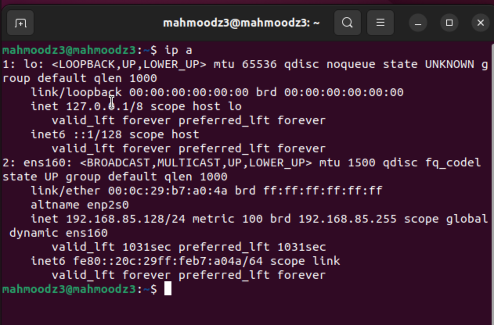

To find your network interface, run the command ip a. In my output, I can see interface ens160 with an IP address.

## Step 3: Configure Snort

### sudo nano /etc/snort/snort.conf

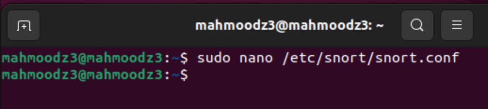

If you want to customize the Snort configuration, open the main configuration file using nano.

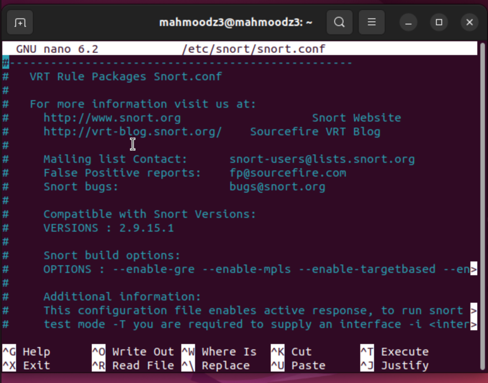

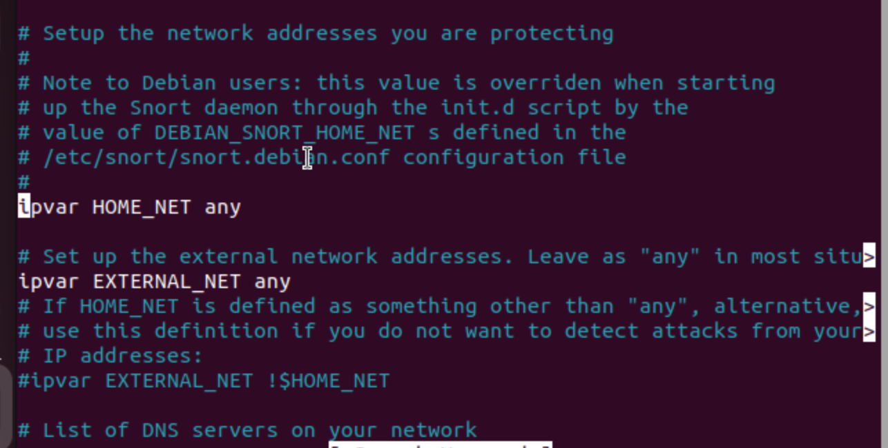

Key sections to check in snort.conf include HOME_NET which ensures it matches your network setup. You can adjust the ipvar HOME_NET to match your network range.

## Step 4: Update and Manage Snort Rules

### sudo wget https://www.snort.org/downloads/community/community-rules.tar.gz

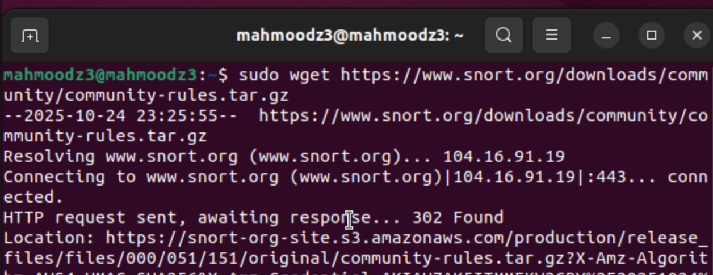

By default, Snort comes with community rules, but we can download additional rules for better threat detection.

### sudo tar -xvzf community-rules.tar.gz

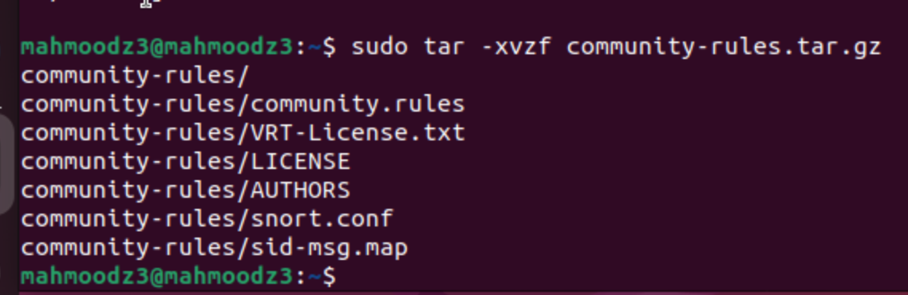

After downloading, we extract the compressed archive using tar.

### sudo cp community-rules/* /etc/snort/rules/

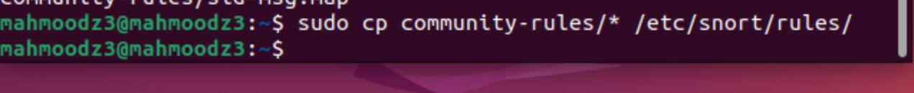

Now we copy all the extracted community rules to the /etc/snort/rules/ directory where Snort looks for its rule files.

### cd /etc/snort/rules

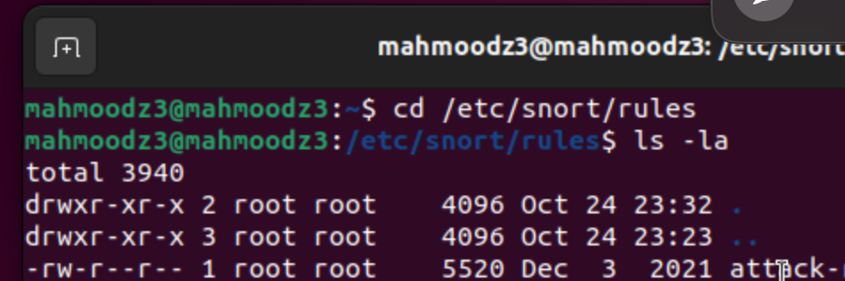

Navigating to the rules directory, we can see all the rule files that are now available. Without rules, Snort would just be monitoring traffic without knowing what to flag as problematic.

## Step 5: Test Snort Configuration

### sudo snort -T -c /etc/snort/snort.conf

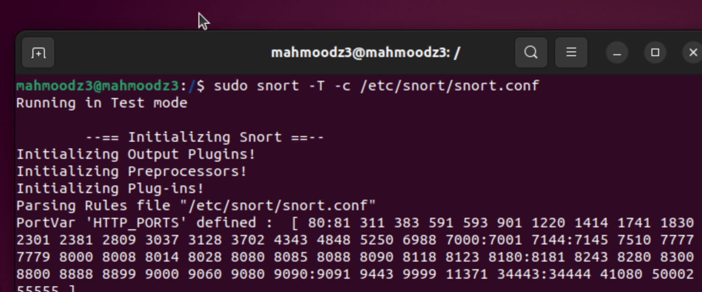

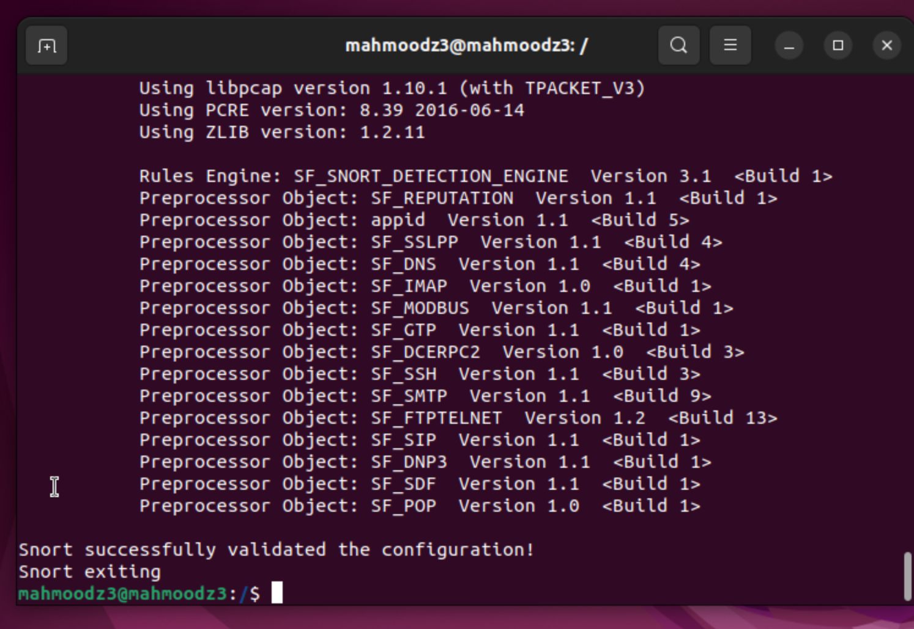

After configuring, we test that Snort is working properly by running a configuration test with the -T flag. At the end, we get the confirmation message: **Snort successfully validated the configuration!**

## Step 6: Running Snort in IDS Mode

### sudo snort -c /etc/snort/snort.conf -i ens160

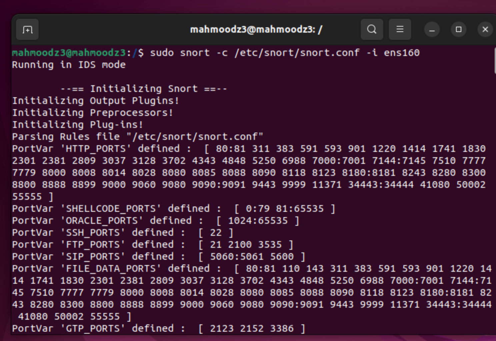

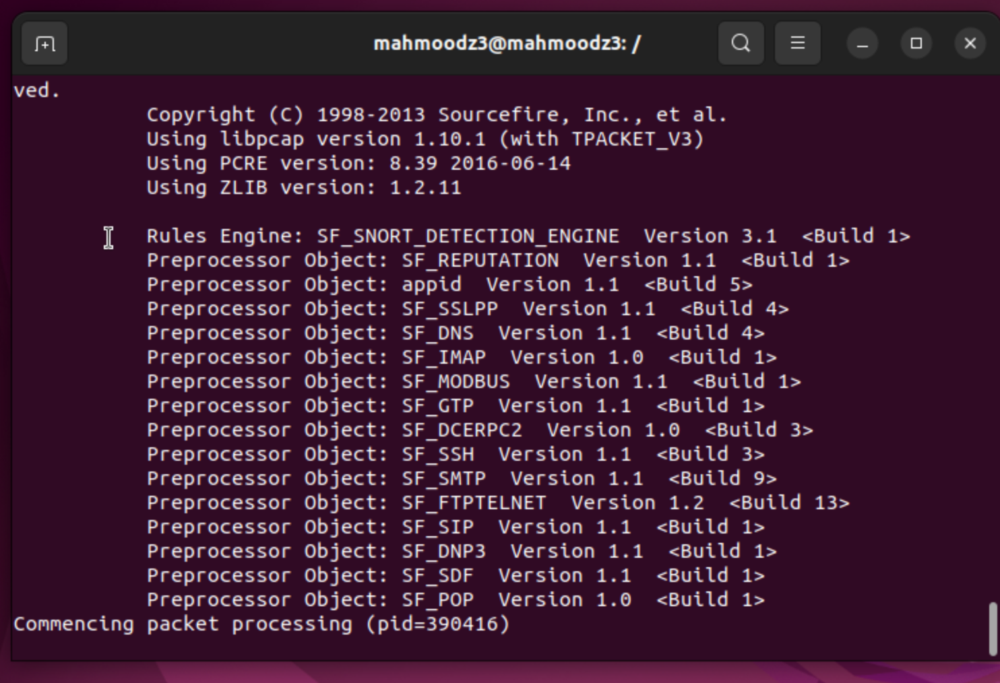

Now that Snort is installed and configured, we can run it in IDS mode to monitor traffic. At the bottom we see "Commencing packet processing (pid=390416)" which indicates Snort is now actively monitoring network traffic.

## Step 7: Viewing Snort Logs

### ls -la

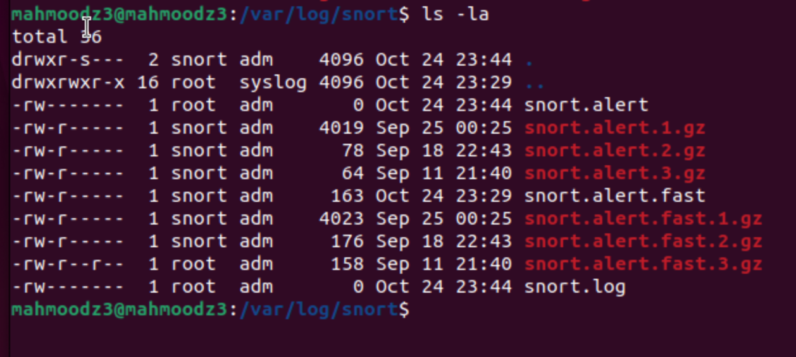

Snort logs alerts in the /var/log/snort/ directory. When we navigate to this directory and run ls -la, we can see various alert files and log files.

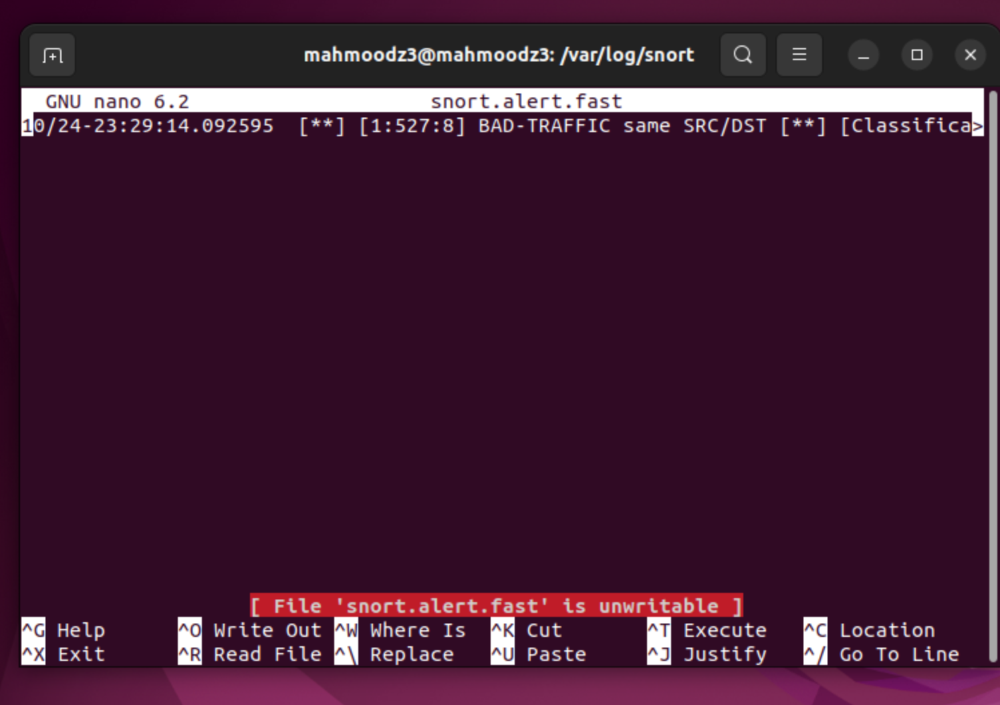

When we open one of the alert files using nano, we can see actual alert entries with timestamps and detected threats.

We found snort.alert files, snort.alert.fast files, and snort.log. The compressed .gz files contain archived alerts from previous sessions, while current files show 0 bytes because there hasn't been enough traffic to trigger alerts yet.

## Step 8: Running Snort as a Daemon

### sudo snort -D -c /etc/snort/snort.conf -i ens160

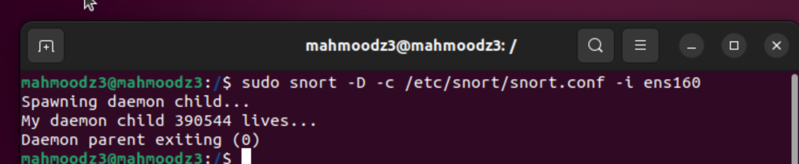

To run Snort in the background as a daemon, we use the -D flag. The output shows Snort has successfully started as a background process with PID 390544.

### ps aux | grep snort

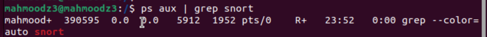

We can verify Snort is running by using ps aux | grep snort. The output shows the Snort process with PID 390595 actively monitoring traffic.

To terminate the Snort daemon, use sudo kill 390595 or sudo pkill snort. If the process doesn't stop, force it with sudo kill -9 390595 or sudo pkill -9 snort.
