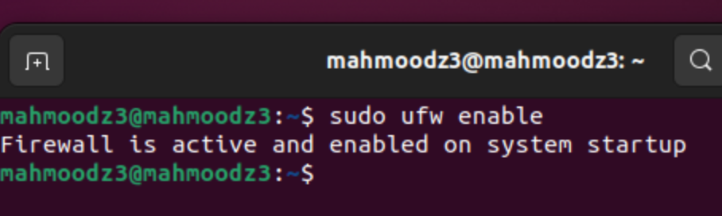

# UFW Firewall Lab

## This report documents the configuration and management of UFW (Uncomplicated Firewall), a commandline tool for managing iptables firewall rules on Linux systems. Today we will be implementing a functional firewall configuration that demonstrates fundamental security principles including deny policies, access controls, IP filtering, and comprehensive logging. Additionally we will explore essential firewall concepts such as port management, IP based access control lists, and logging systems that enable security monitoring and incident response. 

# Enable UFW (Uncomplicated Firewall) 
## sudo ufw status 

The sudo ufw status allows you to check the status of your firewall, whether disabled or active.

## sudo ufw allow 22/tcp  

Before enabling our firewall we want to make sure our connection to SSH is valid. We do this by allowing access to port22. The reason why this is important is because if we don't we will immediately start to block all incoming connections including our current ssh session which is on port22. We want to keep that open so we can continue using our network security server.

## sudo ss -tuln   

Tuln allows us to check for TCP, UDP, and Listening. n displays addresses in numeric form. Socket Statistics (ss) is a command for checking network statistics. If you see a port you are unsure of, you can check the specific service of that port
using: *sudo lsof -i :portNumber*

## sudo ufw enable   

The sudo ufw enable command allows us to activate our firewall on our server. Important to take a look at our prerequisites before doing so.

Lets take a look at the current status of our progress 

Great we can see our recent updates! 

## sudo ufw allow 80/tcp, sudo ufw allow 443/tcp

For a webserver you should allow incoming traffic through ports 80 for HTTP traffic and port 443 for HTTPS (Secured) traffic. 

## sudo ufw status verbose   

We can now take a look at our updated status with the command sudo ufw status verbose, we can view changes to our incoming port traffic and what sort of traffic is allowed or not with a verbose command that displays more detailed information. As you can see our logging status is low, and we will change and describe that later. We are also allowing outgoing traffic.

## sudo ufw deny from 10.0.0.0 

Say you want to block traffic coming from a specific bad actor that you've identified, you can do so with his IP with command sudo ufw deny from 'IP here'

## sudo allow from x.x.x.x to any port 587

Conversely say you want to allow traffic coming from a specific IP Address and a specific port, you can do so with it's IP with command sudo ufw allow from 'IP Here' to any port 'Port Here' 

Here we are allowing access to 192.168.1.50 on port 587. Port 587 is typically a secure mail server for modern mail servers. It is known under the Simple Mail Transfer Protocol. 

Lets confirm the status of our servers here one more time to confirm the changes 

## sudo allow from x.x.x.x to any port 587

# Enable UFW Logging 

## sudo ufw logging on

Make sure you having logging enabled before running a check

## sudo ufw logging high

If you would like to have varying details of complexity in your logs you can run this following commands, and get a status message like above if succesfull. 

low: Minimal logging, mainly for blocked incoming packets.
medium: Includes blocked incoming packets with additional packet header
details.
high: Includes all blocked packets and connection information.
full: Extensive logging of all UFW events. 

## sudo tail -f /var/log/ufw.log 

Your UFW logs are stored in /var/log/ufw.log and you can use command -f to monitor your logs in real time. Here is what our logs like with high logging status enabled. 

## sudo grep 'DENY' /var/log/ufw.log
## sudo grep 'ALLOW' /var/log/ufw.log

To filter entries by specific text use the above grep commands. You can look at denied entries in the log files and allowed entries in the log files with their respective commands. Our deny command is empty as we are starting a new server, but this would change with traffic coming in. 